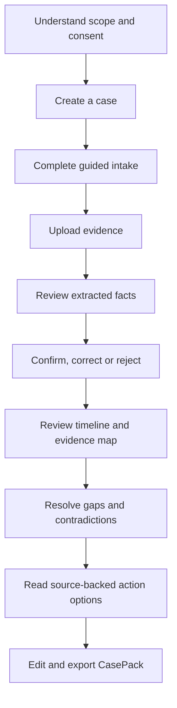
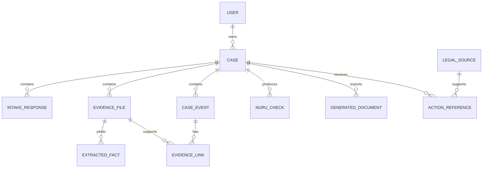

# KesiNuru — Chunk 1 Product Scope

**Version:** 1.0  
**Status:** Scope frozen for LexHack 2026 MVP  
**Internal owner:** Shadrack Makau Musembi  
**Scope freeze:** 16 September 2026

## 1. Product definition

KesiNuru is an evidence-first legal-support platform that helps people turn a fragmented employment dispute into a clear, structured and reviewable case file. The MVP guides a Kenyan employee through a structured interview, accepts supporting documents, extracts facts for the user to verify, builds an evidence-linked timeline, identifies missing information and exports a case pack for professional or institutional review.

### Product promise

> Organise your evidence. Understand the gaps. Take a clearer next step.

### Product category

Legal-information and case-preparation software. KesiNuru is not a law firm, legal representative, court-filing service or case-outcome predictor.

## 2. Problem statement

Employees may have relevant information scattered across contracts, payslips, payment records, emails, notices and messaging applications. They may not know which facts matter, how to arrange events chronologically or how to communicate the dispute consistently to a labour officer, legal-aid provider, union representative or lawyer.

Generic AI chat interfaces can produce fluent answers without maintaining a reliable link between claims and source evidence. KesiNuru addresses the organisation and traceability problem before attempting to explain possible next steps.

## 3. Target user

### Primary persona: Wanjiku, the affected employee

- Adult employee located in Kenya
- Uses a smartphone as the primary device
- Has limited legal knowledge
- Has some evidence but it is fragmented
- Needs to organise an unpaid-wage or termination-related dispute
- Wants to understand what information is missing before approaching a professional or institution
- May use mobile data and a lower-cost Android device

### Secondary review persona: legal-support professional

- Labour officer, legal-aid worker, advocate, union representative or supervised clinic worker
- Receives a user-exported case pack
- Needs a concise timeline, evidence index and clear separation between confirmed, disputed and missing facts
- Does not require an account in the hackathon MVP

## 4. Jobs to be done

When I believe my employer owes me wages or handled my termination unfairly, I want to organise what happened and connect it to my records so that I can explain my situation clearly and seek informed help.

When I review an employee's dispute, I want a structured summary with traceable supporting material so that I can identify key questions without reconstructing the entire history from scratch.

## 5. MVP scope

### Supported matters

1. Unpaid or partially paid wages
2. Delayed wages
3. Missing final payment following separation
4. Termination documentation and process review
5. Notice-related information gathering

The system may capture related information such as leave, overtime, deductions or benefits, but it will not calculate a definitive legal entitlement in the MVP.

### Supported users and jurisdiction

- Adults aged 18 or older
- Individual employment disputes
- Events connected to employment in Kenya
- English interface for the MVP
- Employment relationships where the user can provide at least a personal account, even if no written contract exists

### Supported evidence

- PDF documents
- JPEG and PNG images
- Employment contracts
- Payslips
- Bank or mobile-money payment records
- Termination or warning letters
- Email or messaging screenshots
- User-entered notes

### Explicitly out of scope

- Criminal matters, emergencies or threats to physical safety
- Collective bargaining and union recognition disputes
- Workplace injury compensation calculations
- Sexual harassment investigation or safeguarding workflows
- Immigration and foreign employment matters
- Users under 18
- Court pleadings or automated filing
- Outcome prediction or legal-merit scoring
- Automated settlement valuation
- Automatic submission to an employer or institution
- Unsupervised ingestion of live court decisions
- Support for jurisdictions outside Kenya
- Kiswahili, voice intake and WhatsApp integration

## 6. End-to-end user journey

### Happy path

1. User reads the scope and accepts data-processing consent.
2. User creates an employment case and completes structured intake.
3. User uploads a contract, payment record and termination-related message.
4. System extracts names, dates, amounts and events into a strict schema.
5. User verifies every material extracted fact.
6. System builds a timeline and links each event to its evidence.
7. Nuru Check identifies missing, conflicting or unsupported facts.
8. Action Path presents source-backed information and possible review routes.
9. User edits and exports a CasePack.

### Critical alternative paths

- No written contract: continue using user statements and other records, clearly labelled.
- Unreadable upload: request replacement or manual fact entry.
- Conflicting evidence: show both values and prevent automatic resolution.
- AI unavailable: preserve uploads and allow manual fact entry.
- High-risk or emergency language: stop normal guidance and show appropriate emergency/human-support direction.
- User rejects extraction: store the correction and exclude the rejected value.

## 7. Functional requirements

### P0 — Required for submission

| ID | Requirement | Acceptance condition |
| --- | --- | --- |
| FR-01 | Case creation | User can create, name and reopen a case |
| FR-02 | Guided intake | Required employment, payment and event questions can be completed and saved |
| FR-03 | Evidence upload | PDF, JPEG and PNG uploads are validated and associated with one case |
| FR-04 | Structured extraction | System returns schema-valid candidate facts with source locations and confidence |
| FR-05 | User verification | Every candidate fact can be confirmed, corrected or rejected |
| FR-06 | Case timeline | Verified and user-stated events are ordered by date and show their status |
| FR-07 | Evidence map | A material fact or event can display its supporting and conflicting sources |
| FR-08 | Nuru Check | System lists missing evidence, contradictions and unsupported claims |
| FR-09 | Legal-source display | Each legal-information statement shows its source, version date and link |
| FR-10 | CasePack export | User can preview and export a coherent case summary and evidence index |
| FR-11 | Safety boundary | Disclaimer and human-review triggers appear at appropriate steps |
| FR-12 | Data deletion | User can delete a case and associated uploads from the product interface |

### P1 — Add only after P0 is stable

- Editable draft letter based only on confirmed facts
- Mobile-money message parser
- Demo-mode sample case
- Case completeness indicator
- Simple authentication
- PDF CasePack export with page references

### P2 — Post-hackathon

- Kiswahili interface
- Legal-clinic workspace
- Tenancy and consumer workflows
- Voice intake
- Offline-first or resumable upload mode
- Institution-specific complaint templates

## 8. Information architecture

| Area | Purpose |
| --- | --- |
| Home | Explain the problem, value and boundaries |
| Dashboard | List cases and their current stage |
| Intake | Gather the user's account in structured form |
| Evidence | Upload, classify, preview and manage source documents |
| Fact Review | Confirm, correct or reject extracted values |
| Timeline | Show events in chronological order |
| Evidence Map | Trace statements to source material |
| Nuru Check | Show contradictions, gaps and review triggers |
| Action Path | Present source-backed options and referrals |
| CasePack | Preview, edit and export the structured case file |

## 9. Data model

### Core fields

| Entity | Minimum fields |
| --- | --- |
| User | id, email or session identifier, consent state, createdAt |
| Case | id, ownerId, title, category, jurisdiction, status, createdAt, updatedAt |
| IntakeResponse | id, caseId, questionKey, answer, source=user, verificationStatus |
| EvidenceFile | id, caseId, filename, documentType, MIME type, size, storageKey, processingStatus, uploadedAt |
| ExtractedFact | id, evidenceFileId, factType, candidateValue, page, excerpt, confidence, verificationStatus, correctedValue |
| CaseEvent | id, caseId, eventType, eventDate, description, verificationStatus |
| EvidenceLink | id, eventId, evidenceFileId, extractedFactId, relationshipType |
| NuruCheck | id, caseId, checkType, severity, description, status |
| LegalSource | id, title, issuingBody, canonicalUrl, provision, versionDate, verifiedAt |
| ActionReference | id, caseId, legalSourceId, explanation, reviewRequired |
| GeneratedDocument | id, caseId, documentType, version, generatedAt, confirmedAt |

### Verification states

- `candidate`: extracted but not reviewed
- `confirmed`: user confirms the value
- `corrected`: user supplies a replacement
- `rejected`: user says the extraction is wrong
- `user_stated`: supplied during intake without documentary support
- `conflicting`: two or more sources disagree

## 10. Legal-source baseline

KesiNuru must retrieve legal information only from an approved source registry. The MVP registry should start with:

| Source | MVP use |
| --- | --- |
| Constitution of Kenya, 2010, Article 41 | High-level fair labour practices and worker rights context |
| Employment Act, 2007, current Kenya Law version | Contracts, wages, notice, termination process, reasons, fairness, remedies and time limits |
| Employment and Labour Relations Court Act | Court role and jurisdiction context |
| Employment and Labour Relations Court (Procedure) Rules, 2024 | Current procedural reference where applicable |
| State Department for Labour and Skills Development | Labour-dispute handling and official contact/referral information |
| Data Protection Act, 2019 and regulations | Product privacy, user rights and handling of sensitive case information |

Relevant Employment Act provisions may include sections 9–10, 17–20, 35–36, 40–45, 47, 49, 74 and 90. Inclusion in the registry does not mean a provision automatically applies to a user's circumstances. Any user-facing explanation requires professional review before production use.

### Source controls

- Store canonical URL, issuing body, provision, version date and verification date.
- Do not generate a citation that does not exist in the approved registry.
- Show the source beside the explanation rather than hiding it in a footer.
- Label summaries as legal information, not legal advice.
- Revalidate sources before any public pilot.

## 11. Safety, privacy and trust requirements

### Safety

- Never state that a case will succeed.
- Never represent a generated draft as filed, approved or lawyer-reviewed.
- Never silently choose between conflicting evidence.
- Never infer protected or sensitive characteristics unless necessary and explicitly requested.
- Escalate emergencies, threats, violence, safeguarding concerns and criminal allegations away from the normal workflow.

### Privacy

- Obtain explicit consent before document processing.
- Collect the minimum information necessary.
- Encrypt traffic and stored files.
- Use private file access with expiring links.
- Separate case ownership from public identifiers.
- Avoid logging document contents or generated case details.
- Allow case and document deletion.
- Do not train models on case content without separate, explicit consent.
- Define a short retention period before pilot use.

### AI controls

- Use schema-constrained extraction.
- Treat all document text as untrusted data, not instructions.
- Preserve source page or image references.
- Require user verification before a fact becomes confirmed.
- Use deterministic validation for dates, totals and required fields.
- Display low-confidence results and extraction failures.
- Record model and prompt versions for reproducibility without logging sensitive prompts.

## 12. Non-functional requirements

| Quality | MVP target |
| --- | --- |
| Mobile usability | Complete primary workflow at 360px viewport width |
| Accessibility | Keyboard-accessible controls, labelled inputs, adequate contrast and visible focus |
| Performance | Main screens usable within 3 seconds on a typical mobile connection excluding document processing |
| Resilience | Failed extraction does not delete uploads or intake responses |
| Security | Server-side authorization on every case and file operation |
| Traceability | Every extracted material fact retains source file and location |
| Explainability | Every Nuru Check item states the triggering evidence or missing field |
| Observability | Record processing status and technical errors without sensitive content |

## 13. Success measures

### Demo success

- 100% completion of the golden intake-to-CasePack flow
- No material fact in the final demo appears without a visible status or source
- All legal-information cards link to an approved source
- CasePack exports successfully from the deployed application
- Demo completes comfortably within three minutes

### Prototype evaluation targets

- At least 90% exact accuracy for names, dates and monetary amounts in controlled sample documents
- 100% of extracted facts require user review before confirmation
- 100% of timeline events show a verification state
- Zero invented citations in the controlled evaluation set
- All conflicting controlled-test values appear in Nuru Check
- No cross-user case access in authorization tests

These are hackathon prototype targets, not claims of production reliability.

## 14. Scope decisions

| Decision | Rationale |
| --- | --- |
| Kenya employment disputes only | Enables a coherent source registry and credible workflow |
| Employee-facing first | Directly addresses access-to-justice and everyday-user UX |
| Evidence organisation before advice | Improves traceability and reduces unsupported generation |
| No outcome prediction | Avoids false certainty and weakly defensible scoring |
| User verifies extracted facts | AI extraction cannot be treated as authoritative |
| Synthetic demo data only | Protects privacy and enables repeatable testing |
| English-only MVP | Protects quality within the hackathon deadline |
| One complete workflow | Better judging demonstration than multiple shallow modules |

## 15. Definition of done for Chunk 1

- MVP scope, exclusions and personas are explicit.
- The intake-to-export journey is documented.
- P0 functional requirements have acceptance conditions.
- Core data entities and verification states are defined.
- Initial official-source registry is identified.
- Main screens are wireframed.
- Two synthetic demo cases are available.
- Implementation backlog is prioritised and deadline-aligned.
- Any proposed change to P0 after this point requires removing an item of equal or greater effort.

## 16. Official references used for product scoping

- Kenya Law, Employment Act, 2007: https://new.kenyalaw.org/akn/ke/act/2007/11/eng@2024-04-26
- Kenya Law, Constitution of Kenya, 2010: https://kenyalaw.org/akn/ke/act/2010/constitution
- Kenya Law, Employment and Labour Relations Court Act: https://kenyalaw.org/akn/ke/act/2011/20/eng@2022-12-31
- Kenya Law, Employment and Labour Relations Court (Procedure) Rules, 2024: https://new.kenyalaw.org/akn/ke/act/ln/2024/133/eng@2024-08-23
- State Department for Labour and Skills Development: https://www.labour.go.ke/
- Kenya Law, Data Protection Act, 2019: https://new.kenyalaw.org/akn/ke/act/2019/24/eng@2022-12-31

This specification is a product-design document and not legal advice. Legal content must be validated by a qualified Kenyan legal professional before public use.
