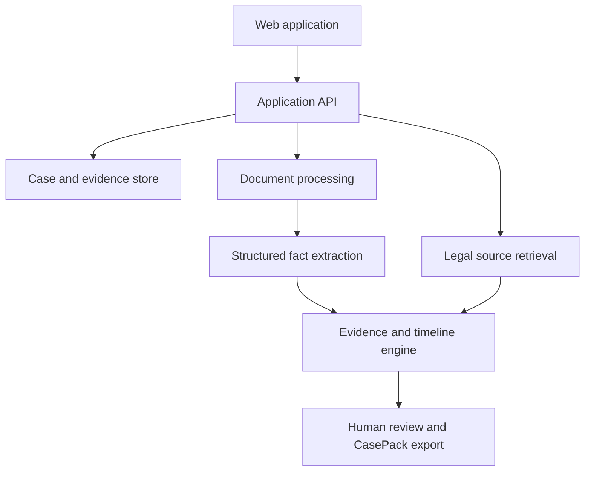

# KesiNuru

> **Clarity for your case.**

KesiNuru is an evidence-first legal-support platform that helps people turn an unstructured legal problem into a clear, organised and reviewable case file. It guides users through structured intake, extracts relevant facts from supporting documents, constructs an evidence-linked timeline, identifies missing information and prepares an exportable case pack for professional review.

The initial MVP focuses on helping employees in Kenya organise disputes involving unpaid wages, termination and related employment issues.

## The problem

People often know that something unfair has happened but do not know how to document it, which information matters or where to begin. Relevant evidence may be scattered across contracts, messages, notices, payment records and personal recollections. This makes it difficult to explain the situation consistently to a legal-aid provider, regulator, union representative or lawyer.

Most general-purpose AI legal assistants respond to questions in a chat interface. KesiNuru takes a different approach: it creates a structured and traceable connection between the user's account, their evidence, the applicable legal information and the next action they may consider.

## The solution

KesiNuru guides a user through six stages:

1. **Describe the issue** through a structured, plain-language interview.
2. **Upload supporting evidence**, such as contracts, payslips, payment records, notices, emails or screenshots.
3. **Review extracted facts**, including parties, dates, amounts, obligations and disputed events.
4. **Build an evidence map and timeline** connecting every material statement to its source.
5. **Identify gaps and possible next steps** using source-backed legal information and risk-aware guidance.
6. **Export a case pack** for review by a qualified professional or relevant institution.

## MVP scope

The hackathon MVP is intentionally narrow and will demonstrate one complete workflow for a Kenyan employment dispute.

### Included

- Guided employment-dispute intake
- Document and image upload
- OCR and structured fact extraction
- User confirmation or correction of extracted facts
- Chronological event timeline
- Evidence-to-claim mapping
- Missing-evidence checklist
- Source-linked legal information
- Editable complaint or demand-letter draft
- Exportable case summary and evidence index
- Confidence indicators and human-review escalation

### Not included in the MVP

- Representation by a lawyer
- Predictions about whether a case will succeed
- Automatic submission to a court or government institution
- Support for criminal emergencies
- Unrestricted coverage of every jurisdiction or area of law
- Fully autonomous legal decision-making

## Product principles

### Evidence before conclusions

Every material conclusion should show which user-provided evidence supports it. Unsupported statements must be labelled as unverified rather than presented as fact.

### The user remains in control

Extracted facts, timelines and generated documents must be editable and confirmed by the user before export or submission.

### Sources must be inspectable

Legal information should link to an identifiable and authoritative source. The system must never invent statutes, cases, deadlines or institutions.

### Uncertainty must be visible

KesiNuru should communicate missing information, conflicting evidence and confidence limitations. High-risk or ambiguous situations should be routed to qualified human assistance.

### Privacy by design

Legal documents can contain sensitive personal data. The system should minimise collection, protect data in transit and at rest, restrict access, provide deletion controls and avoid using private case material for model training without explicit consent.

## Core modules

| Module | Responsibility |
| --- | --- |
| Nuru Intake | Conducts the guided interview and collects structured case facts |
| Document Processor | Performs OCR, classification and structured extraction |
| Evidence Map | Connects claims and events to supporting or conflicting evidence |
| Case Timeline | Orders verified and unverified events chronologically |
| Nuru Check | Detects missing information, contradictions and review triggers |
| Action Path | Presents source-backed options and escalation routes |
| CasePack | Produces an exportable summary, timeline and evidence index |

## Proposed architecture



## Proposed technology stack

The final stack may change as the prototype evolves.

- **Frontend:** Next.js, TypeScript and Tailwind CSS
- **Backend:** Next.js server routes or Node.js service
- **Database:** PostgreSQL with Prisma
- **File storage:** Private object storage with time-limited access
- **Document processing:** OCR plus schema-constrained extraction
- **AI layer:** Retrieval-grounded language model with structured outputs
- **Authentication:** Secure email or OAuth authentication
- **Export:** Server-generated PDF and JSON case bundle
- **Deployment:** Vercel-compatible frontend and managed backend services

## Safety boundaries

KesiNuru provides legal information and case-organisation support. It does not provide legal representation and is not a law firm. Its outputs may be incomplete or incorrect and must not be treated as a substitute for advice from a qualified legal professional.

The production system should include:

- A prominent legal-information disclaimer
- Emergency and high-risk escalation rules
- Jurisdiction and source-version labels
- Citation and source validation
- Prompt-injection protection for uploaded documents
- Strict file validation and malware scanning
- Role-based access controls
- Encryption in transit and at rest
- Audit logging without exposing unnecessary document contents
- User-controlled export and permanent deletion

## AI quality and evaluation

The prototype should be evaluated on more than the fluency of generated text. Important measures include:

- Accuracy of extracted dates, amounts, parties and obligations
- Percentage of claims linked to valid evidence
- Citation validity and source coverage
- Contradiction and missing-information detection
- Hallucination rate
- Successful completion of the intake-to-export workflow
- User comprehension of generated explanations
- Correct escalation of high-risk scenarios

## Getting started

The application source code and runnable setup instructions will be added as implementation begins. The expected local workflow will be:

```bash
git clone <repository-url>
cd kesinuru
cp .env.example .env.local
npm install
npm run dev
```

Environment variables, database migrations and seed instructions will be documented before the first runnable release. Never commit secrets or real user case files to the repository.

## Roadmap

### Phase 1 — Hackathon MVP

- Complete the employment-dispute workflow
- Support a controlled set of sample documents
- Validate extracted facts with the user
- Generate an evidence-linked timeline and CasePack
- Deploy a working demonstration

### Phase 2 — Pilot readiness

- Conduct review with Kenyan legal professionals and potential users
- Strengthen privacy, access controls and retention policies
- Add institution and legal-aid referral pathways
- Expand testing with anonymised and synthetic cases
- Improve accessibility and low-bandwidth performance

### Phase 3 — Responsible expansion

- Add carefully validated tenancy and consumer workflows
- Introduce English and Kiswahili interfaces
- Add organisation portals for legal clinics
- Support jurisdiction-specific source packs
- Conduct independent security and legal-quality assessments

## Contributing

KesiNuru is in an early prototype stage. Contribution guidelines and a code of conduct will be added before accepting general public contributions. Contributors must not submit confidential legal documents, personal data or copyrighted datasets without permission.

## Responsible disclosure

Please do not publish vulnerabilities that could expose user documents or personal information. A private security contact and coordinated disclosure process will be provided before public deployment.

## Licence

Copyright 2026 Shadrack Makau Musembi.

Licensed under the Apache License, Version 2.0. See [LICENSE](LICENSE) for the complete licence text.

Unless explicitly stated otherwise, sample legal content, datasets and third-party materials are not automatically covered by the software licence and must be used according to their respective terms.

## Project status

KesiNuru is an early-stage prototype being developed for LexHack 2026. It is not currently suitable for use in real legal matters.
