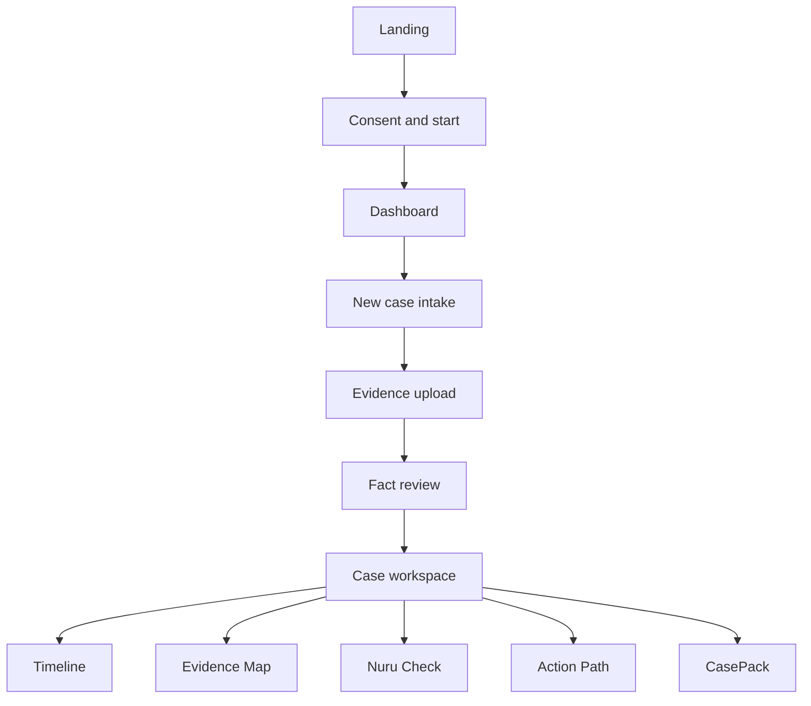

# KesiNuru MVP Wireframes

These low-fidelity wireframes define hierarchy, required states and primary actions. They intentionally avoid prescribing final colours, illustrations or animation.

## Global layout

- Mobile-first responsive application
- Public header: KesiNuru wordmark, How it works, Safety, Sign in
- Authenticated header: wordmark, Cases, Help, profile menu
- Persistent save-state indicator during intake
- Plain-language legal-information banner where relevant
- One dominant action per screen

## Screen map

## 1. Landing page

### Above the fold

| Region | Content |
| --- | --- |
| Header | Wordmark, How it works, Safety, Sign in |
| Eyebrow | Evidence-first employment support |
| Headline | Turn scattered records into a clear case file |
| Supporting text | Explain the intake, evidence mapping and CasePack outcome |
| Primary action | Start organising my case |
| Secondary action | View a sample case |
| Trust note | Legal information, not legal representation |

### Remaining sections

1. Three-step explanation: tell, verify, prepare
2. Supported matter cards
3. Evidence traceability illustration
4. Privacy and user-control commitments
5. Clear limitations
6. Final call to action

## 2. Consent and eligibility

### Content order

1. “Before we begin” heading
2. Eligibility checklist:
   - I am at least 18
   - My employment was connected to Kenya
   - I understand this is not a lawyer or emergency service
3. Data-processing summary
4. Link to fuller privacy information
5. Consent checkbox
6. Continue button

### Blocking states

- Under 18: explain that MVP cannot process the matter
- Emergency or immediate danger: show urgent human-support direction
- Outside Kenya: explain jurisdiction limitation

## 3. Dashboard

| Area | Content |
| --- | --- |
| Welcome | Brief explanation and New case action |
| Case cards | Case title, category, updated date, current stage, completion |
| Resume action | Continue from the exact incomplete step |
| Privacy action | Delete case from overflow menu with confirmation |
| Empty state | Sample visual plus “Create your first case” |

## 4. New-case intake

### Desktop arrangement

- Left: vertical step list
- Centre: one question group at a time
- Right: contextual help and why the information matters

### Mobile arrangement

- Progress bar and short step label
- Single-column question form
- Help appears in an expandable panel
- Back, Save and continue actions remain reachable

### Steps

1. Employment relationship
2. Employer and role
3. Pay agreement
4. What happened
5. Termination or separation
6. Communication and actions taken
7. Desired outcome
8. Review answers

### States

- Saved
- Saving
- Offline/error with retry
- Required field missing
- User does not know
- User has no document

## 5. Evidence upload

| Region | Content |
| --- | --- |
| Guidance | Accepted formats, privacy note and examples |
| Upload area | Select files or camera images |
| File list | Filename, type, size, status and remove action |
| Document type | Contract, payslip, payment record, notice, message or other |
| Processing status | Waiting, processing, needs attention, ready |
| Primary action | Review extracted facts |

An upload must not appear successful until server confirmation. Failed files remain visible with a retry option.

## 6. Fact review

### Fact card

| Element | Example |
| --- | --- |
| Fact type | Monthly salary |
| Candidate value | KES 45,000 |
| Source | Employment Contract, page 2 |
| Excerpt | Short highlighted source text |
| Confidence | High, medium or low with explanation |
| Actions | Confirm, correct, reject |

### Required behaviours

- Original candidate remains visible after correction.
- Corrected value requires explicit save.
- Source preview opens near the referenced page.
- Bulk confirmation is not allowed for low-confidence facts.
- Continue button shows how many material facts remain unreviewed.

## 7. Case workspace

### Summary header

- Case title and status
- Last saved time
- Overall preparation indicator
- Export CasePack action

### Tabs

1. Overview
2. Timeline
3. Evidence Map
4. Nuru Check
5. Action Path
6. CasePack

### Overview cards

- Parties
- Dispute summary
- Key amounts
- Key dates
- Evidence count
- Unresolved checks

## 8. Timeline

Each event card contains:

- Date or approximate date
- Event description
- Status badge: confirmed, corrected, user-stated or conflicting
- Evidence chips
- Edit action
- “Why this appears here” explanation

Filters: all events, payment, employment, communication, termination and user-stated.

## 9. Evidence Map

### Two-panel layout

- Left: important facts and events
- Right: selected source preview and extracted passage

Relationships are described using words rather than colour alone:

- Supports
- Conflicts with
- User stated; no document attached
- Needs review

## 10. Nuru Check

### Sections

1. Conflicting information
2. Missing documents or answers
3. Unsupported statements
4. Low-confidence extraction
5. Human-review triggers

Each card states:

- What was detected
- Which fields or evidence triggered it
- Why it matters for case preparation
- How the user can resolve or acknowledge it

Severity must indicate workflow impact, not legal-case strength.

## 11. Action Path

### Header warning

“These are information and preparation options, not a prediction or instruction from a lawyer.”

### Action card

- Plain-language option title
- When a person might consider it
- Information or evidence commonly needed
- Official source and date
- Questions to ask a qualified professional
- Mark for CasePack toggle

No option should be labelled “best,” “guaranteed” or “recommended by KesiNuru.”

## 12. CasePack preview

### Sections

1. Cover and disclaimer
2. User-confirmed case overview
3. Parties
4. Timeline
5. Evidence index
6. Confirmed and corrected facts
7. Conflicts and missing information
8. Source-backed information reviewed
9. Questions for professional review
10. Optional editable draft letter

### Actions

- Edit summary
- Select optional sections
- Preview PDF
- Export PDF
- Export structured JSON

## Reusable components

- Status badge
- Source citation card
- Evidence chip
- Fact verification card
- Empty state
- Error and retry panel
- Consent notice
- Legal-information disclaimer
- Processing progress row
- Delete confirmation dialog

## Design validation checklist

- A first-time user can identify the main action within five seconds.
- Every AI-produced value visibly requires or displays verification.
- Source information is accessible without leaving the primary workflow.
- Status is communicated through text and icon, not colour alone.
- All primary controls work with keyboard navigation.
- Mobile layouts avoid horizontal scrolling at 360px.
- The interface never describes KesiNuru as a lawyer.
